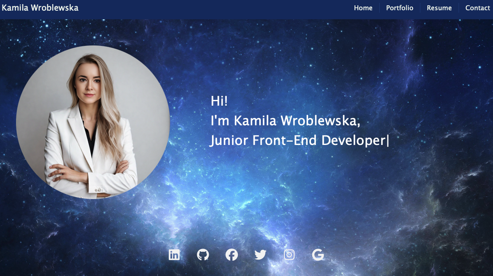

# Portfolio

<p>
    
    
    
    
    
</p>


## Contents

1. [Description](#description)
2. [Usage](#usage)
3. [Installation](#installation)
4. [Credits](#credits)
5. [License](#license)
6. [Contributing](#contributing)
7. [Tests](#tests)
8. [Questions](#contact-information)

## Description

Welcome to my portfolio! I'm Kamila, a passionate Junior Front -end Developer with a love for creating innovative solutions and exploring new technologies. This repository serves as a showcase of my skills, projects, and experiences.


## Usage
 

## Installation

To clone the repo:
```
git clone git@github.com:kamilawroblewska/KamilaWroblewska-Portfolio.git
``` 
Run 'npm install' to install dependencies

Run 'npm run dev' to run the page

Open the 'host link' file from the output folder in a web browser to view

---

## Credits

Technologies used:   
react-dom  
bootstrap  
fontawsome 


## License

[](https://opensource.org/licenses/MIT) 

---

## Contributing

Please follow the contribution guidelines!

## Tests:

 N/A


## Contact Information:
* GitHub Username: [kamilawroblewska](https://github.com/kamilawroblewska)
* GitHub Repo: [PORTFOLIO](https://github.com/kamilawroblewska/KamilaWroblewska-Portfolio)
* Email: kamila.wroblewska15@gmail.com
 <p>
    <a href="https://www.linkedin.com/in/kamila-wroblewska-bb61142a5"></a>
    </p>


